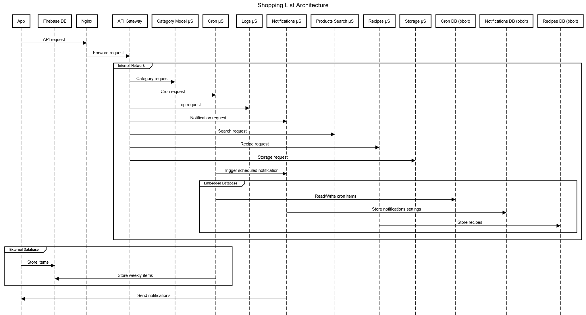
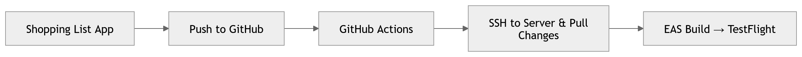
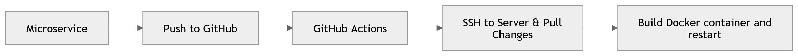

#  Shopping List

A mobile app to manage your shopping list and recipes.

The app is intended for **private use by a family or small group of users**.  
It does not implement authentication and therefore is **not designed for public distribution on the App Store**.

## Features

### For All Users

- **Shopping List Management**
  - Add, edit, and delete items from the shopping list
  - Add images to the shopping list
  - Items are automatically categorized using a prediction model

- **Recipes**
  - Add, edit, and delete recipes
  - Mark recipes as favorites
  - Filter recipes for easier browsing

- **Product Search**
  - Search for products to quickly add them to your list

- **Weekly Items**
  - Add items to a weekly list
  - These items are automatically added to the shopping list every week

- **Notifications**
  - Receive notifications when someone adds or deletes items from the shopping list
  - Receive notifications when an item from the weekly list is automatically added

- **Customization**
  - Customize the app appearance
  - Adjust application settings

---

### For Admin Users

- **Logs Management**
  - View all application logs

- **Prediction Model Training**
  - Review items where the predicted category was incorrect
  - Correct the category to improve the prediction model

---

## Architecture

The application follows a **microservice-based architecture**.  
The mobile app communicates with **Nginx**, which acts as a reverse proxy in front of the **API Gateway**.  
The API Gateway then routes requests to the appropriate backend microservices.

Each microservice manages its own responsibilities and storage.

### Reverse Proxy (Nginx)

**Nginx** is used as the entry point for all API requests and provides several infrastructure-level features:

- **HTTPS termination** – Handles SSL/TLS so all client communication is secure.
- **Domain routing** – Maps the public domain name to the backend services.
- **Rate limiting** – Protects the API from abuse and excessive requests.
- **Reverse proxying** – Forwards incoming requests to the API Gateway running inside the internal Docker network.

### Data Storage

The application uses multiple storage solutions depending on the type of data:

- **Firebase Realtime Database** – Used to store and synchronize **shopping list items** in real time between users and devices.
- **bbolt (embedded database)** – Each microservice manages its own local database for persistent service-specific data such as recipes, notifications, and cron items.

Using Firebase allows the shopping list to update instantly across devices, while the microservices maintain their own independent storage for backend functionality.

### System Architecture

The following diagram shows the overall system architecture, including the mobile app, Nginx reverse proxy, API gateway, microservices, and external services.



### CI/CD Pipelines

The project uses **GitHub Actions** to automate building and deployment.

#### Mobile App Pipeline

The mobile application pipeline builds the app using **EAS Build** and publishes it to **TestFlight**.



#### Microservices Pipeline

Each microservice is automatically deployed by pulling the latest code on the server and rebuilding the Docker container.



---

## Installation

### Requirements

- [ Node.js ≥ v22](https://nodejs.org/en)
- [Yarn](https://classic.yarnpkg.com/lang/en/docs/install/#windows-stable)
- [Go ≥ 1.25.0](https://go.dev/doc/install)
- [Docker](https://docs.docker.com/)
- [Docker Compose](https://docs.docker.com/compose/install/)
- [Expo Go](https://expo.dev/go)
- [Expo Access Token](https://docs.expo.dev/accounts/programmatic-access/)

### Setup

Clone the repository and follow the instructions for all microservices and the app.

```bash
git clone https://github.com/BryanVanWinnendael/shopping-list
```
