# 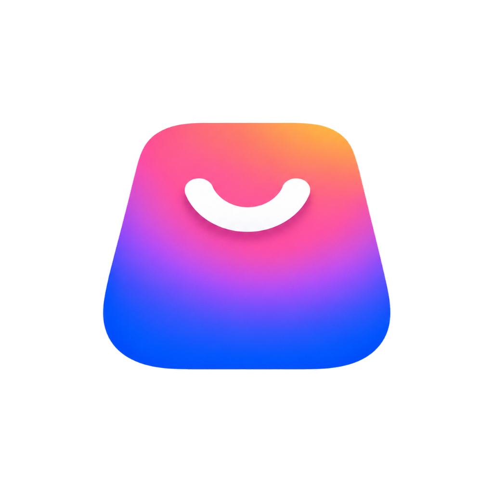 Shopping List

A mobile app to manage your shopping list and recipes.

The app is intended for **private use by a family or small group of users**.  
It does not implement authentication and therefore is **not designed for public distribution on the App Store**.
It is only tested and recommended for iOS.

## Features

### For All Users

- **Shopping List Management**
  - Add, edit, and delete products from the shopping list
  - Add images to the shopping list
  - Products are automatically categorized using a prediction model

- **Recipes**
  - Add, edit, and delete recipes
  - Mark recipes as favorites
  - Filter recipes for easier browsing

- **Product Search**
  - Search for products to quickly add them to your list or recipes

- **Weekly Products**
  - Add products to a weekly list
  - These products are automatically added to the shopping list every week

- **Notifications**
  - Receive notifications when someone adds or deletes products from the shopping list
  - Receive notifications when an item from the weekly list is automatically added

- **Customization**
  - Customize the app appearance
    - Dark mode
    - Liquid glass
    - Accent colors
  - Adjust application settings

---

### For Admin Users

- **Logs Management**
  - View all application logs

- **Prediction Model Training**
  - Review items where the predicted category was incorrect
  - Correct the category to improve the prediction model

---

#### Screenshots

<div style="display: flex; flex-wrap: wrap; gap: 10px;">
  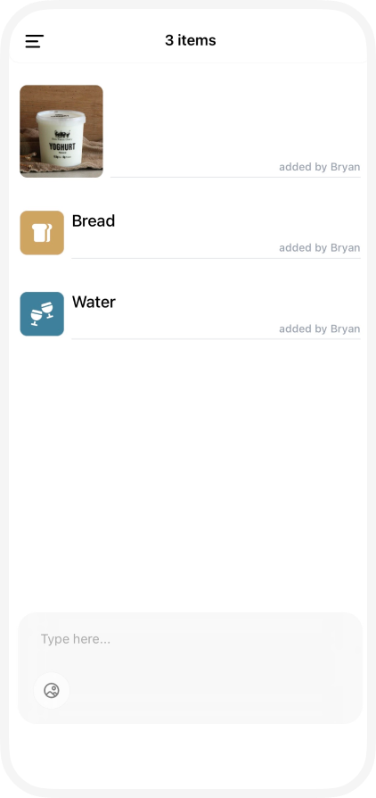
  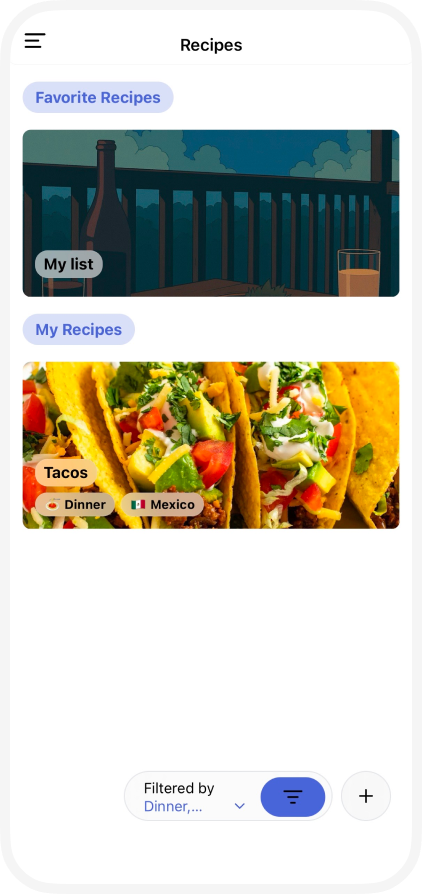
  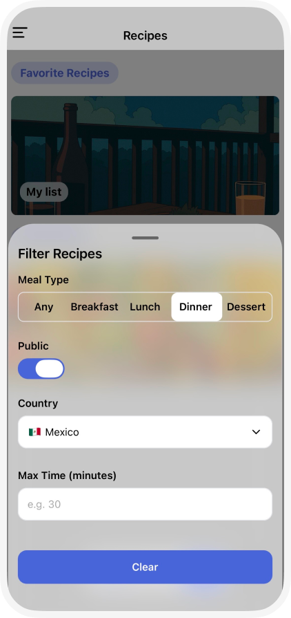
  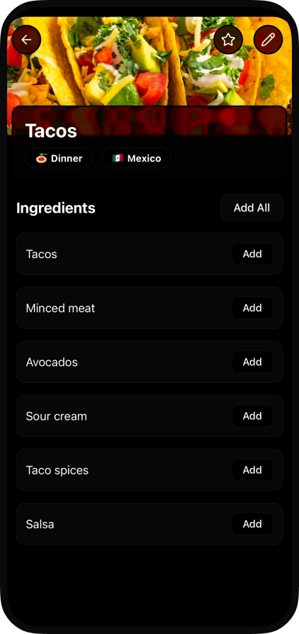
  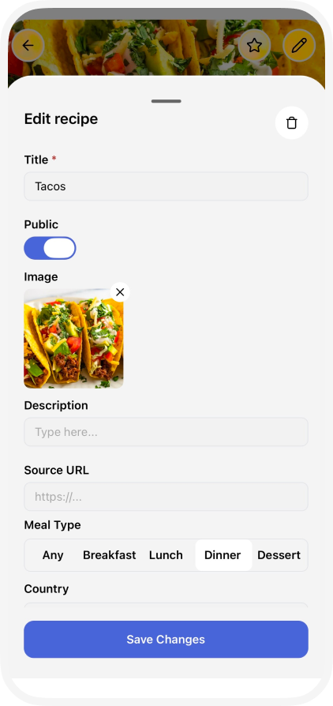
  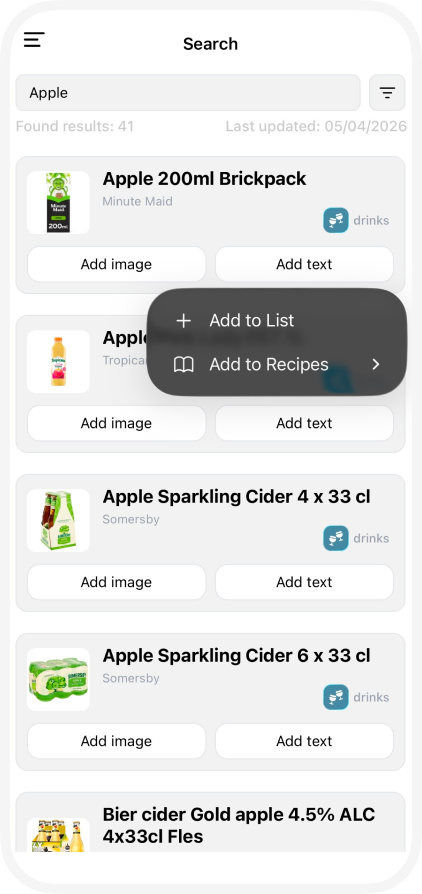
  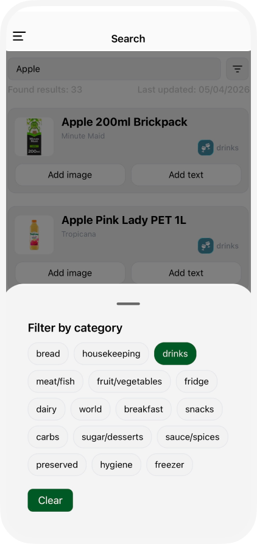
  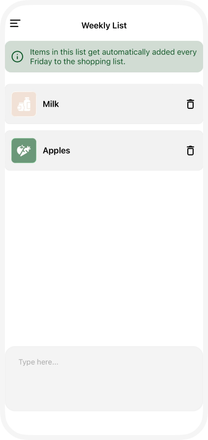
  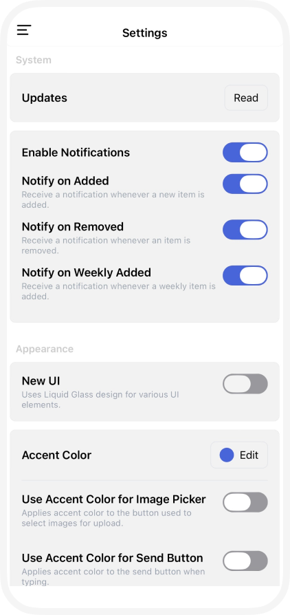
  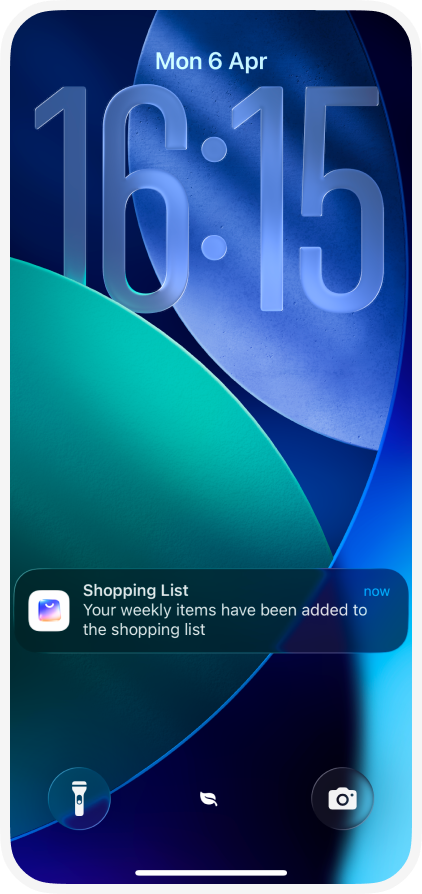
</div>

---

## Architecture

The application follows a **microservice-based architecture**.  
The mobile app communicates with **Nginx**, which acts as a reverse proxy in front of the **API Gateway**.  
The API Gateway then routes requests to the appropriate backend microservices.

Each microservice manages its own responsibilities and storage.

### Reverse Proxy (Nginx)

**Nginx** is used as the entry point for all API requests and provides several infrastructure-level features:

- **HTTPS termination** – Handles SSL/TLS so all client communication is secure.
- **Domain routing** – Maps the public domain name to the backend services.
- **Rate limiting** – Protects the API from abuse and excessive requests.
- **Reverse proxying** – Forwards incoming requests to the API Gateway running inside the internal Docker network.

### Data Storage

The application uses multiple storage solutions depending on the type of data:

- **Firebase Realtime Database** – Used to store and synchronize **shopping list products** in real time between users and devices.
- **bbolt (embedded database)** – Each microservice manages its own local database for persistent service-specific data such as recipes, notifications, and cron items.

Using Firebase allows the shopping list to update instantly across devices, while the microservices maintain their own independent storage for backend functionality.

### Shared Contracts and Models

To ensure consistency across all services, the backend uses shared contracts and models.

Contracts define the request and response structures exchanged between the mobile application and the backend services.
Models define the shared domain entities used across the microservices.

By sharing these definitions, all services use the same data structures, reducing duplication and preventing inconsistencies between services.

For the mobile application, TypeScript types are automatically generated from the shared contracts and models with the following command:
```bash
yarn generate
```

### System Architecture

The following diagram shows the overall system architecture, including the mobile app, Nginx reverse proxy, API gateway, microservices, and external services.

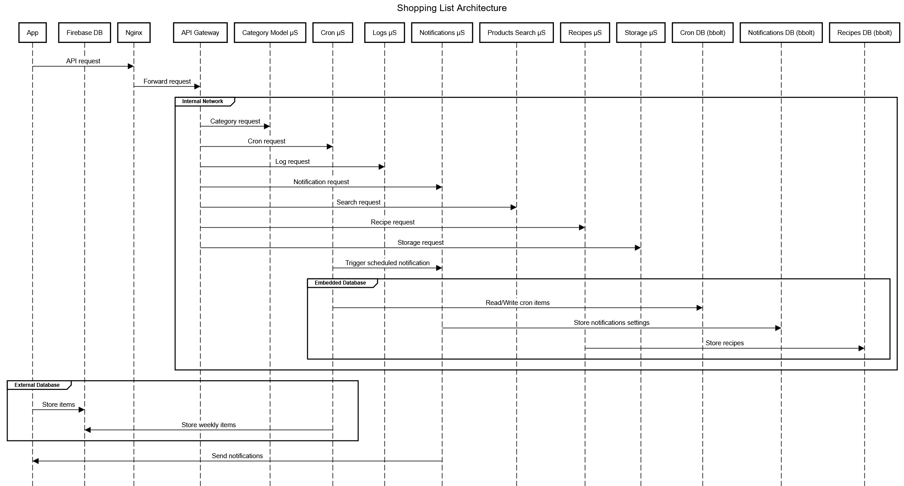

### CI/CD Pipelines

The project uses **GitHub Actions** to automate building and deployment.

#### Mobile App Pipeline

The mobile application pipeline builds the app using **EAS Build** and publishes it to **TestFlight**.


```mermaid
flowchart LR

    A([Trigger Workflow]) --> B{Validate inputs}

    B -->|Invalid| C["Stop workflow"]
    B -->|Valid| D["Checkout repository"]

    D --> E["Setup Node.js 20<br/>Enable Yarn cache"]

    E --> F["Install dependencies"]

    F --> G["Create App Store Connect API key<br/>auth.p8"]

    G --> H["Build & Submit"]

    H --> I{Inputs}

    I -->|Version + Build| J["yarn build<br/>--v=VERSION<br/>--build=BUILD_NUMBER"]

    I -->|Version only| K["yarn build<br/>--v=VERSION"]

    I -->|Build only| L["yarn build<br/>--build=BUILD_NUMBER"]


    J --> M["eas-release.js"]
    K --> M
    L --> M


    M --> N{Update app.config.js}


    N -->|New version| O["Set version<br/>Reset buildNumber = 0"]

    N -->|Same version| P["Keep version<br/>Increment buildNumber +1"]

    N -->|Build only| Q["Keep version<br/>Replace buildNumber"]

    N -->|Version + Build| R["Set version<br/>Set buildNumber"]


    O --> S["EAS iOS Build"]

    P --> S

    Q --> S

    R --> S


    S --> T["Submit to App Store Connect"]

    T --> U["Cleanup<br/>Remove auth.p8"]

    U --> V([Workflow complete])


    S --> ERR1["Build failed"]

    T --> ERR2["Submit failed"]
```

#### Cron Mobile App Pipeline

The CI/CD cron workflow runs every two months to ensure the app remains active and does not expire. The TestFlight provisioning profile, however, has a validity period of 90 days.


```mermaid
flowchart LR

    A([Cron Trigger<br/>Every 2 months<br/>1st day at 00:00 UTC])

    A --> B["Checkout repository"]

    B --> C["Setup Node.js 20<br/>Enable Yarn cache"]

    C --> D["Install dependencies<br/>yarn install --frozen-lockfile"]

    D --> E["Create App Store Connect API key<br/>Generate auth.p8"]

    E --> F["Run next build script<br/>node scripts/eas-build.js"]


    F --> G["Read app.config.js"]

    G --> H["Get current version"]

    G --> I["Get current App buildNumber"]

    I --> J["Increment buildNumber +1"]

    J --> K["Update app.config.js<br/>Save new buildNumber"]


    K --> L["Run EAS iOS Build"]

    L --> M["Submit build to App Store Connect"]


    M --> N["Cleanup<br/>Remove auth.p8"]

    N --> O([Workflow complete])


    L --> X["Build failed"]

    M --> Y["Submit failed"]
```

#### Microservices Pipeline

Overview of the automated deployment workflow for all microservices, including testing, image creation, publication to GHCR, server deployment, and image lifecycle management.


```mermaid
flowchart LR
  A[Trigger Workflow] --> B[Checkout Repository]
  B --> C[Run Tests]
  C --> D{Tests Pass?}

  D -->|No| E[Fail Workflow]

  D -->|Yes| F[Read .version]

  F --> G{Workflow Dispatch?}

  G -->|No| J[Use Current Version]

  G -->|Yes| H{Version Type}

  H -->|Patch| H1[Increment Patch<br/>1.0.0 → 1.0.1]
  H -->|Minor| H2[Increment Minor<br/>1.0.0 → 1.1.0]
  H -->|Major| H3[Increment Major<br/>1.0.0 → 2.0.0]
  H -->|Custom| H4[Use Custom Version Input]
  
  H1 --> I[Update .version]
  H2 --> I
  H3 --> I
  H4 --> I
  
  I --> I1[Commit & Push .version]
  I1 --> J
  
  J --> K[Set VERSION]
  
  K --> L[Check GHCR for Version]
  L --> M{Image Exists?}
  
  M -->|Yes| N[Skip Build & Deploy]
  
  M -->|No| O[Build Docker Image]
  O --> P[Push Image to GHCR]
  P --> Q[SSH to Server]
  
  Q --> R[Docker Login GHCR]
  R --> S[docker compose pull]
  S --> T[docker compose up -d]
  
  T --> U{Previous Version Different?}
  
  U -->|Yes| V[Delete Previous Image]
  U -->|No| W[Skip Cleanup]
  
  V --> X[Deployment Complete]
  W --> X
  
  N --> Y[Workflow Complete]
  X --> Y
  
  E --> Z[Workflow Failed]
```

---

## Installation

### Requirements

#### Development Environment

- [Node.js ≥ v22](https://nodejs.org/en)
- [Yarn](https://classic.yarnpkg.com/lang/en/docs/install/#windows-stable)
- [Go ≥ v1.25.0](https://go.dev/doc/install)
- [Air](https://github.com/air-verse/air)
- [Docker](https://docs.docker.com/)
- [Docker Compose](https://docs.docker.com/compose/install/)
- [Expo Go](https://expo.dev/go)
- [Firebase](https://console.firebase.google.com/u/0/)

#### Expo / App Store

- [Expo Access Token](https://docs.expo.dev/accounts/programmatic-access/)
- App Store Connect API Key (`.p8`)
- Apple Developer Team ID
- Apple Developer Account

### Setup

Clone the repository and follow first the instructions for the API Gateway, all microservices and then the app.

```bash
git clone https://github.com/BryanVanWinnendael/shopping-list
```

#### CI/CD Pipelines

In your repository:

`Settings → Secrets and Variables → Actions → New repository secret`

### Expo

#### EXPO_TOKEN
The Expo access token used by EAS CLI for authentication.

#### EXPO_ASC_API_KEY
The App Store Connect API private key (`.p8` file contents).

#### EXPO_ASC_KEY_ID
The App Store Connect API Key ID.

#### EXPO_ASC_ISSUER_ID
The App Store Connect API Issuer ID.

#### EXPO_APPLE_TEAM_ID
The Apple Developer Team ID.

#### EXPO_APPLE_TEAM_TYPE
The Apple team type (for example: `INDIVIDUAL`).

#### EXPO_APPLE_ID
The Apple Developer account email address.


### Server / Deployment

#### SSH_HOST
The host or IP address of your server.

#### SSH_PRIVATE_KEY
The private SSH key used to connect to your server.

#### SSH_USER
The username used for SSH access to your server.
